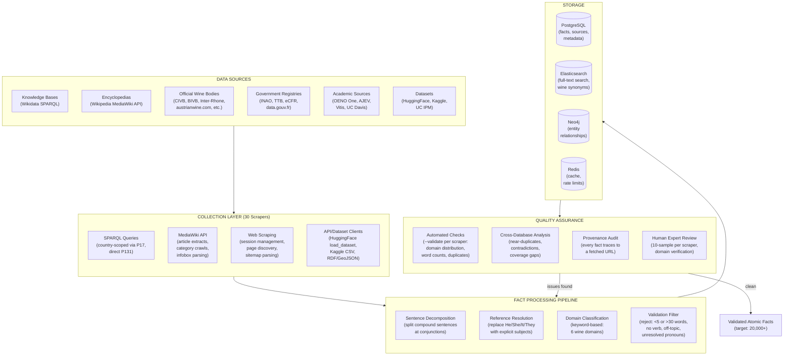
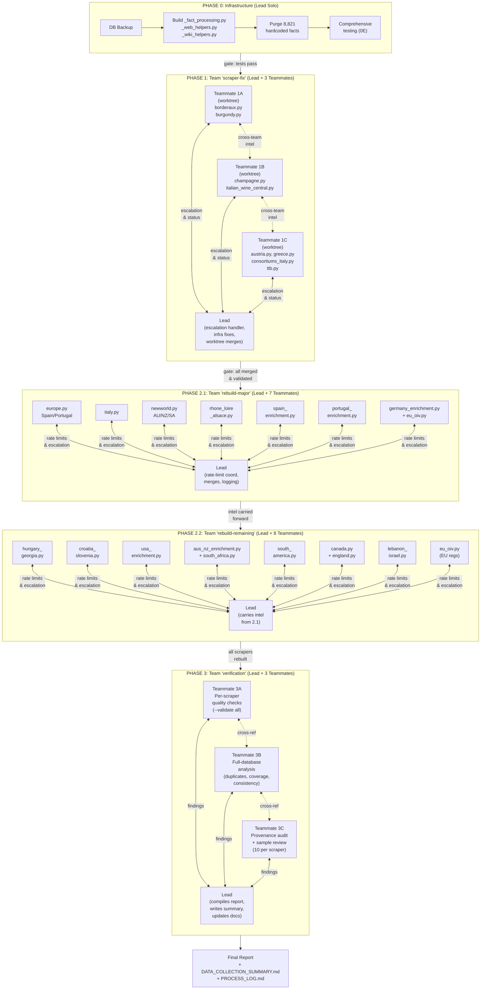
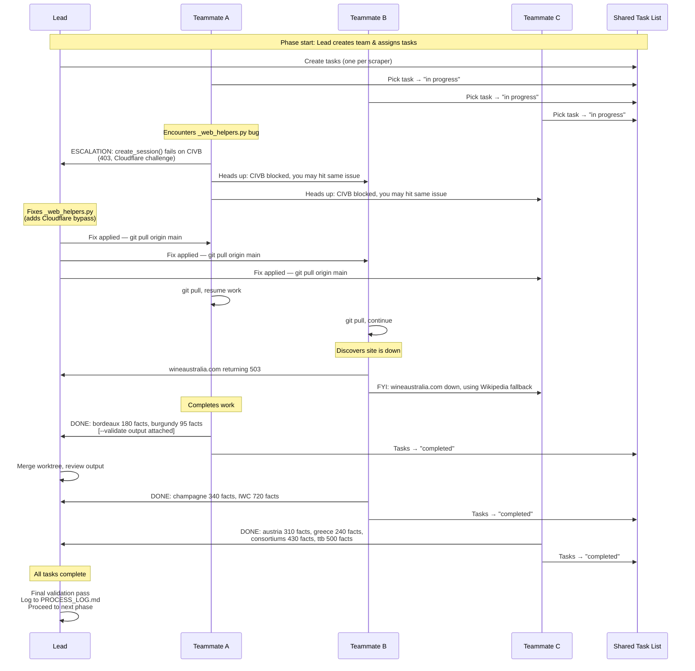
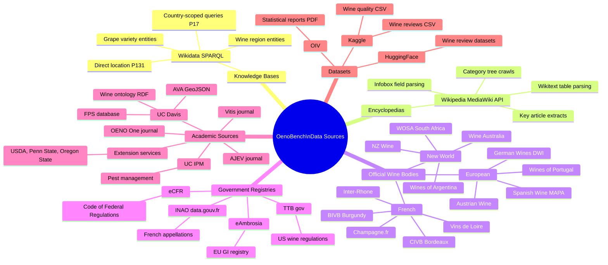
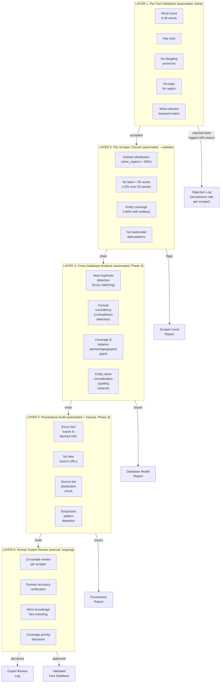
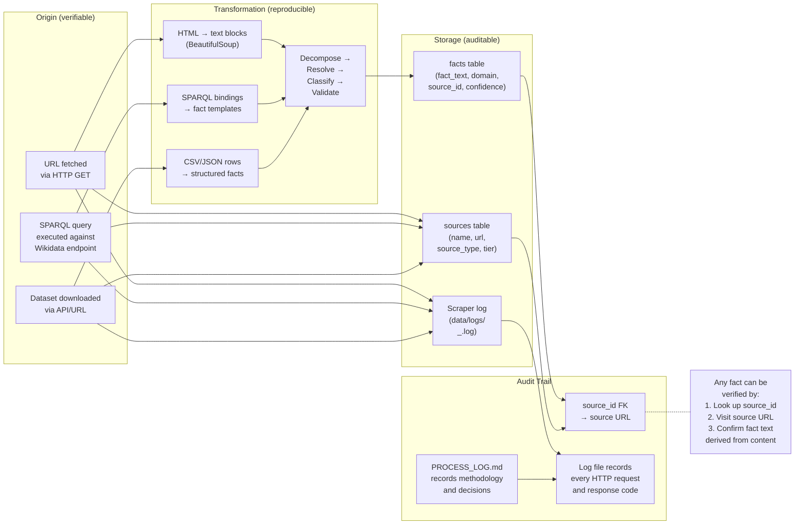
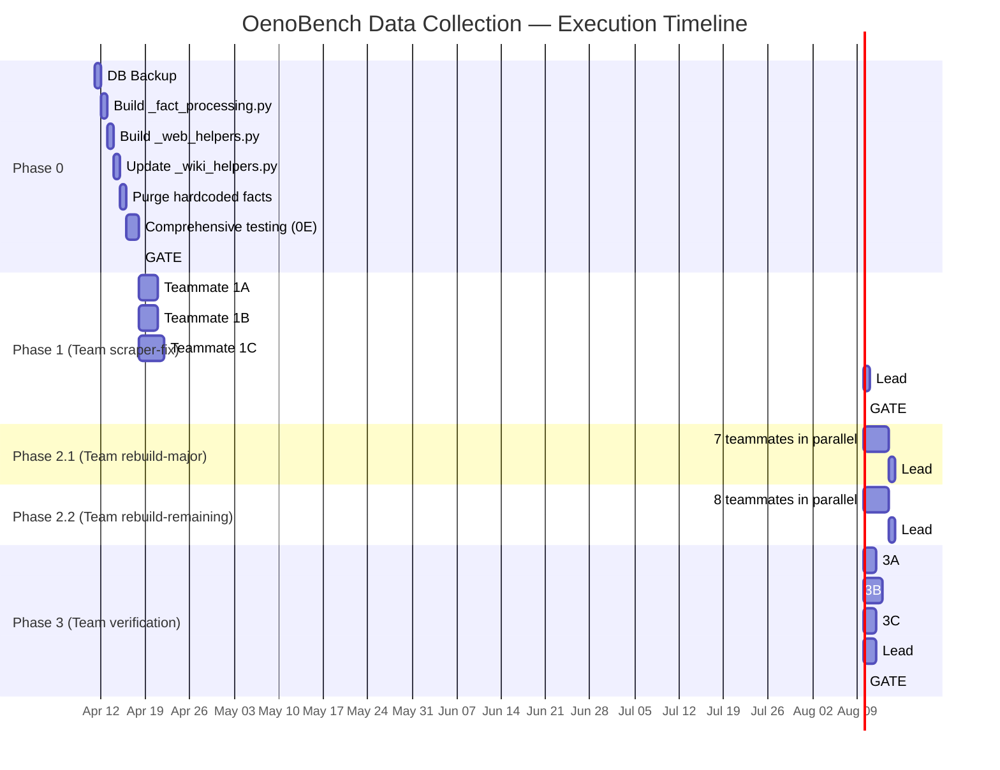
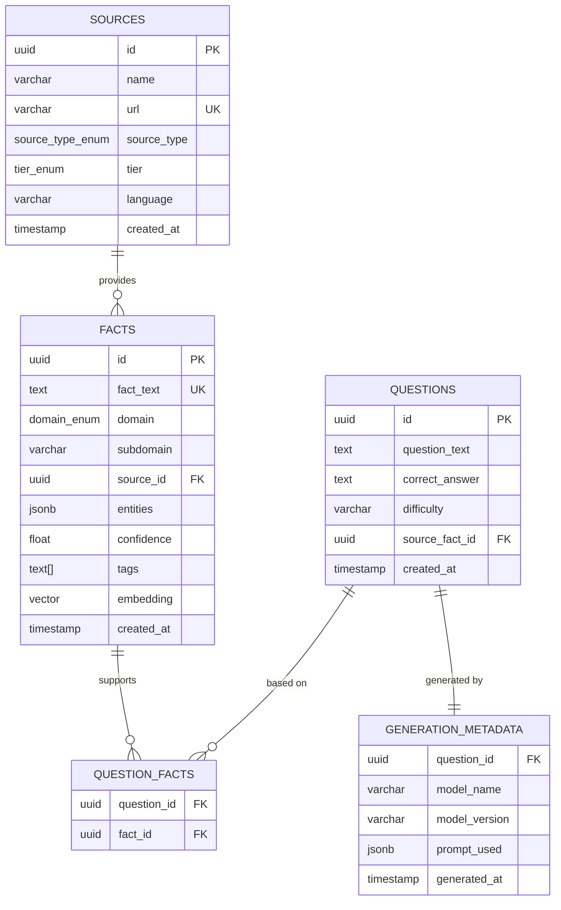
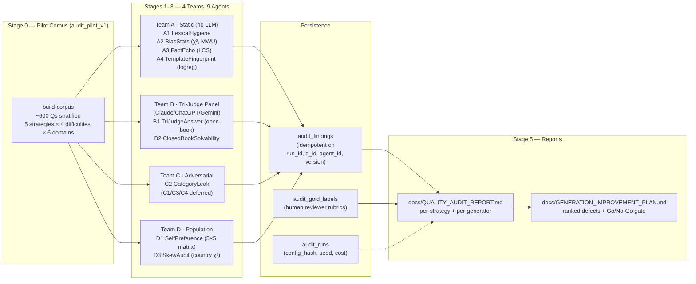

# OenoBench — Data Collection Architecture & Workflow

> Comprehensive scheme of the data collection pipeline, agent team coordination,
> and quality assurance process. Intended for use in the NeurIPS 2026 paper.

---

## 1. High-Level Pipeline Overview

The end-to-end data collection pipeline from raw sources to validated atomic facts.

---

## 2. Fact Processing Pipeline (Detail)

The transformation from raw text to validated atomic facts. This is the core methodology for the paper.

```mermaid
flowchart LR
    RAW["Raw Text\n(Wikipedia extract,\nHTML paragraph,\nSPARQL result)"]

    subgraph DECOMPOSE["1. Decompose"]
        D1["Split at ', and'\n'; ' ', which'"]
        D2["Prepend subject\nto fragments"]
        D3["Cap at 25 words"]
    end

    subgraph RESOLVE["2. Resolve References"]
        R1["Detect leading\npronouns:\nHe/She/It/They"]
        R2["Replace with\nexplicit subject\nfrom article title"]
    end

    subgraph CLASSIFY["3. Classify Domain"]
        CL1["wine_regions"]
        CL2["grape_varieties"]
        CL3["producers"]
        CL4["winemaking"]
        CL5["viticulture"]
        CL6["wine_business"]
    end

    subgraph VALIDATE["4. Validate"]
        V1["Length: 5-30 words"]
        V2["Has verb"]
        V3["No unresolved\npronouns"]
        V4["On-topic for\ntarget region"]
        V5["Wine-relevant\n(keyword match)"]
    end

    ACCEPTED["Accepted\nAtomic Fact"]
    REJECTED["Rejected\n(logged with reason)"]

    RAW --> DECOMPOSE --> RESOLVE --> CLASSIFY --> VALIDATE
    VALIDATE -->|"pass"| ACCEPTED
    VALIDATE -->|"fail"| REJECTED
```

---

## 3. Agent Team Architecture

The multi-agent coordination system using Claude Code Agent Teams.

---

## 4. Escalation & Communication Flow

How teammates coordinate within an Agent Team.

---

## 5. Data Source Taxonomy

Classification of all data sources by type and tier.

---

## 6. Quality Assurance Framework

The multi-layer quality assurance process.

---

## 7. Provenance Chain

How data provenance is guaranteed for every fact in the database.

---

## 8. Phase Execution Timeline

---

## 9. Database Schema (Fact Storage)

---

## Summary Statistics (Targets)

| Metric | Before Cleanup | After Cleanup (Target) |
|--------|---------------|----------------------|
| Total facts in DB | ~24,563 | ~20,000+ (genuine only) |
| Hardcoded/fake facts | ~8,821 | 0 |
| Data sources (by type) | 6 types | 6 types |
| Scrapers (genuine) | 10 | 30+ |
| Facts > 30 words | ~800+ | 0 |
| Dangling references | 231 | 0 |
| Domain = wine_regions | ~50% | < 40% |
| Official website facts | ~20 | 500-2,000+ |
| Provenance: fact → fetched URL | ~60% | 100% |
| Quality layers | 2 (inline + manual) | 5 (see QA Framework) |

---

## 10. Question Quality Audit Framework (Phase 2c/2d, Apr 2026)

The QA layers above operate on **facts** during scraping. After question generation a separate multi-agent audit operates on **generated questions**. Code lives at `src/qa/`; CLI at `python -m src.qa.orchestrator`.

**Key design choices:**
- **Judges (Claude/ChatGPT/Gemini) are kept distinct from generator subjects** — Llama and Qwen are evaluated by D1 SelfPreference, never used as judges, to keep the bias measurement independent.
- **Findings are idempotent and resumable.** Each audit run has a `config_hash`; identical configs reuse already-stored findings. Team B writes inline (not batched), so a 4-hour audit can be killed and resumed without losing work.
- **Population-level findings (A2, A4, D1, D3) are bundled** into a single row per agent (cell breakdowns nested in payload) because the unique constraint cannot distinguish multiple `question_id=NULL` rows from the same agent.
- **The Go/No-Go gate** in `docs/GENERATION_IMPROVEMENT_PLAN.md` sets concrete pass thresholds per agent that must hold before the full 10k generation run is allowed to start.
- **Deferred LLM-driven adversarial agents (C1, C3, C4, B3, B4, D2)** are listed in the report's Limitations section with explicit escalation triggers (e.g., "if A4 AUC ≥ 0.9, run C1 + B4 on flagged subset").

**First audit run (April 19, 2026):** 472 questions, 9 agents, 3,207 LLM calls, **$8.49 total**, 7h wall-clock. Identified 3 critical blockers (verbatim copying 35% fail, world-knowledge solvable 30% fail, country over-rep 4.46×). See `docs/QUALITY_AUDIT_REPORT.md` and `docs/GENERATION_IMPROVEMENT_PLAN.md`.

---

*This document is maintained alongside the codebase. Mermaid diagrams can be
rendered to SVG/PDF for paper figures using `mmdc` (Mermaid CLI) or any
Mermaid-compatible renderer.*
